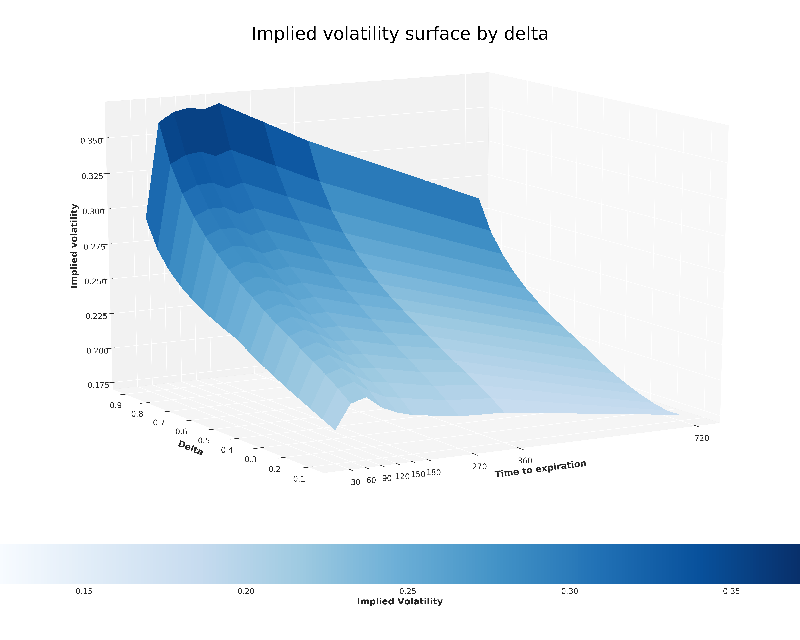
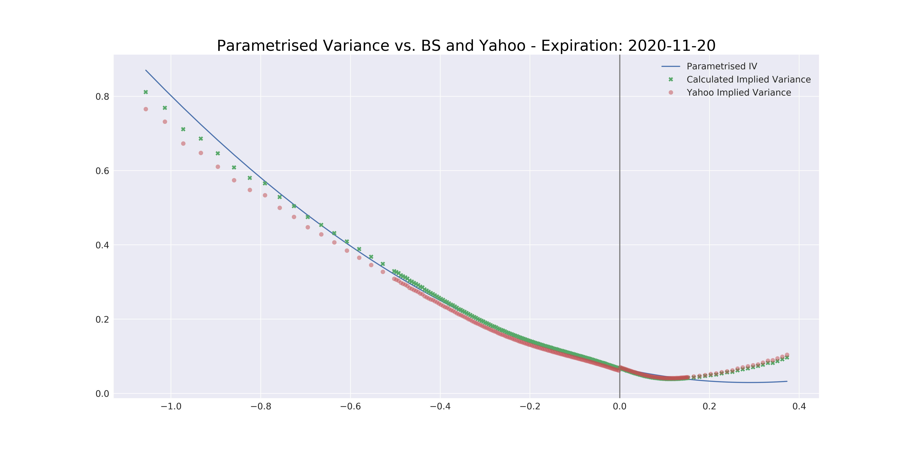

## Construction of a smoothed implied volatility surface using delta

Notebook creates a simple parameterized implied volatility curve by expiration and an implied volatility surface by delta for SPY options.

The notebook is trying to follow iVolatility.com's methodology ( found <a href="ttps://www.ivolatility.com/doc/deltasurfacemethodology.pdf">here</a> ) using Yahoo Option data.

